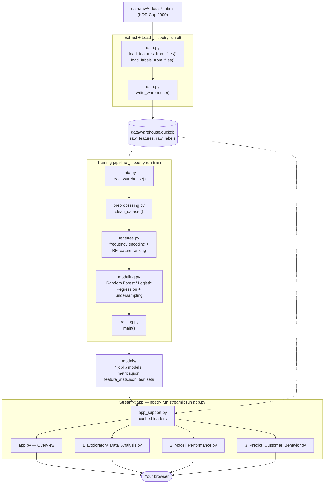

# Customer Relationship Prediction

A Streamlit dashboard that predicts three customer behaviors for a telecom
operator (Orange) using the [KDD Cup 2009](https://kdd.org/kdd-cup/view/kdd-cup-2009/Intro)
dataset:

- **Churn** — will this customer leave for a competitor?
- **Appetency** — will this customer buy additional products or services?
- **Upselling** — will this customer buy an upgrade or add-on?

The project started as a single exploratory notebook (kept in `notebooks/` for
history) and has since been refactored into installable modules, a Poetry
project, and a multipage Streamlit app.

## Architecture

Three separate steps, each reading only what the previous one wrote:
`poetry run elt` extracts the raw files into a DuckDB warehouse, `poetry run
train` reads the warehouse and writes every model artifact to `models/`, and
the Streamlit app only ever reads `models/` (and the warehouse, for the EDA
page) — so it starts instantly instead of re-extracting or retraining on
every launch.



`config.py` (paths, thresholds, hyperparameters) is used throughout the
pipeline but is left out of the diagram to keep it readable.

DuckDB was chosen over a client-server database (e.g. Postgres) because it's
embedded and file-based — no server to run, no Docker required, just a file
committed nowhere and regenerated by `poetry run elt`. A Docker + Airflow
phase (to orchestrate `elt` -> `train` on a schedule, and swap in a
client-server database) is a planned future step, not implemented yet.

## Project structure

```
app.py                        # Streamlit entry point (Overview page)
pages/                        # Streamlit multipage app
  1_Exploratory_Data_Analysis.py
  2_Model_Performance.py
  3_Predict_Customer_Behavior.py
src/customer_behavior/        # Installable package with the core pipeline
  config.py                   # paths, thresholds, hyperparameters
  data.py                     # file extraction + DuckDB warehouse read/write
  elt.py                      # Extract + Load orchestration (CLI: `elt`)
  preprocessing.py            # column/row cleaning
  features.py                 # frequency encoding, RF feature ranking
  modeling.py                 # Random Forest / Logistic Regression training
  training.py                 # orchestrates the full pipeline (CLI: `train`)
  app_support.py              # cached loaders used by the Streamlit pages
data/raw/                     # the original KDD Cup 2009 data files
data/warehouse.duckdb         # generated by `poetry run elt` (gitignored)
models/                       # generated at training time (gitignored)
notebooks/                    # the original exploratory notebook
tests/                        # pytest unit tests for the pipeline modules
```

## Getting started

### Prerequisites

- Python 3.10–3.13
- [Poetry](https://python-poetry.org/docs/#installation)

### 1. Clone the repo

This project lives inside the `Portfolio` monorepo, so clone that and `cd`
into this subfolder — all commands below assume you're inside it:

```bash
git clone https://github.com/rkschroeder/Portfolio.git
cd Portfolio/Customer_Relationship_Prediction
```

### 2. Install dependencies

```bash
poetry install
```

### 3. Extract and load the data

Reads the raw files under `data/raw/` and loads them into a DuckDB warehouse
at `data/warehouse.duckdb` (a `raw_features` table and a `raw_labels` table,
joined on a `customer_id` surrogate key). Everything downstream reads from
here, not from the raw files directly:

```bash
poetry run elt
```

### 4. Train the models

Reads the warehouse and generates every artifact the app reads: trained
Random Forest / Logistic Regression pipelines, the fitted frequency encoder,
per-target feature importances, held-out test sets, and a `metrics.json`
summary — all written to `models/`. Takes a few minutes (six models across
three targets):

```bash
poetry run train
```

### 5. Run the app

```bash
poetry run streamlit run app.py
```

Streamlit prints a local URL (defaults to <http://localhost:8501>) — open it
in your browser.

### 6. Run the tests (optional)

```bash
poetry run pytest
```

## Challenges with this dataset

- **Anonymized features**: columns are named `Var1`...`Var230` with no
  real-world labels — Orange redacted what each one actually measures. This
  rules out domain-informed feature engineering (there's no way to know
  "this is call volume" vs "this is contract length") and shapes the Predict
  page's UI: it can't show meaningful field labels or sensible defaults, so it
  leans on loading real customer records instead of asking you to guess
  plausible values for `Var6`.
- **Heavy missingness**: many of the 230 raw columns are >50% NaN; the
  cleaning pipeline drops columns below an 80% non-null threshold and then
  drops any remaining incomplete rows, which shrinks 50,000 rows to ~36,700.
- **Severe class imbalance**: all three targets (churn, appetency, upselling)
  have a small minority positive class, addressed with undersampling.
- **Mixed, high-cardinality categoricals**: some categorical columns have
  over 15,000 unique values; those are dropped outright, and the rest are
  frequency-encoded rather than one-hot encoded to avoid an explosion of
  features.

## Approach

- **Missing data**: columns that are empty or >20% missing are dropped; rows
  with any remaining missing value are dropped.
- **Categorical features**: frequency encoding (each category replaced by how
  often it appears), chosen over one-hot (too many categories) or target
  encoding (biased by the same class imbalance we're trying to predict).
- **Class imbalance**: random undersampling of the majority class before
  fitting.
- **Models**: Random Forest and Logistic Regression, compared by ROC AUC.
  Random Forest outperforms Logistic Regression on appetency and upselling;
  the two are comparable on churn.
